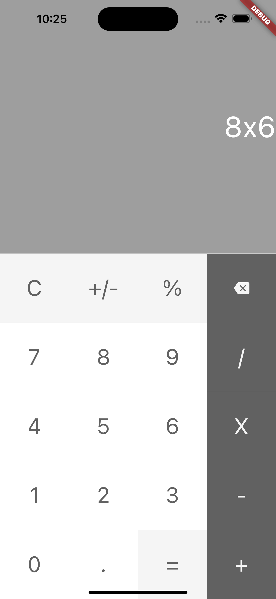

## Description

Projek ini merupakan challenge dalam [Belajar Fundamental Aplikasi Android](https://www.dicoding.com/academies/14) untuk melengkapi fitur kalkulator agar dapat melakukan operasi matematika seperti kalkulator pada umumnya.

## Development Setup

Clone the repository and run the following commands:

```
flutter pub get
flutter run
```

## Source

[Dicoding Academy](https://www.dicoding.com/academies/14)

## Screenshot

 
